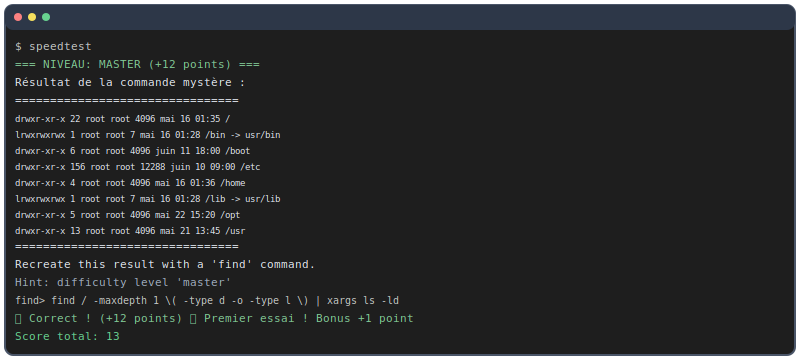

<div align="center">
 
  # Find Command Game
  
  *A terminal-based game to master the Linux `find` command through interactive challenges*
  
  
  
</div>

## 🚀 Installation

```bash
git clone https://github.com/PxpSy/SpeedTestCLI.git
cd SpeedTestCLI
chmod +x install.sh
./install.sh
```

## 🎮 Usage

```bash
speedtest
```

## ✨ Features

- **6 difficulty levels** from Beginner to Master
- **Progressive scoring** with bonus points
- **Comprehensive find options** (type, size, permissions, time, pipes)
- **Interactive hints** and detailed rules
- **Real-time validation** of your commands

## 🖥️ Terminal




## 🗑️ Uninstall

```bash
./uninstall.sh
```

---
<div align="center">
  <i>Master the art of finding files in Linux! 🔍</i>
</div>